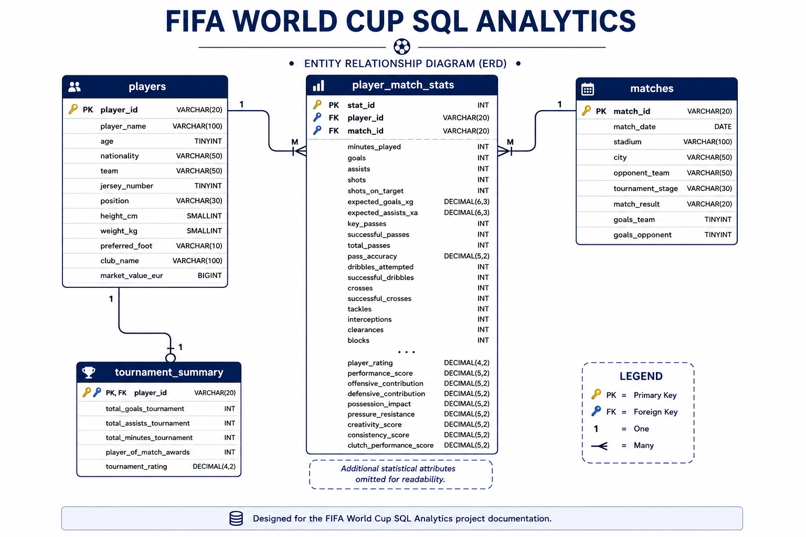
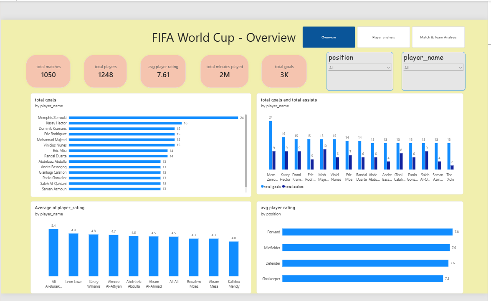
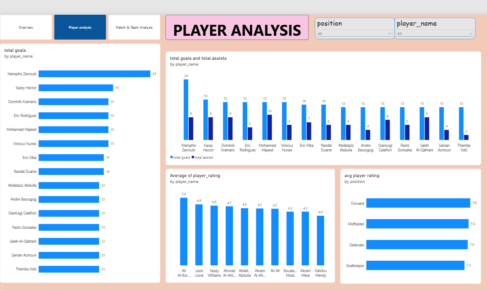
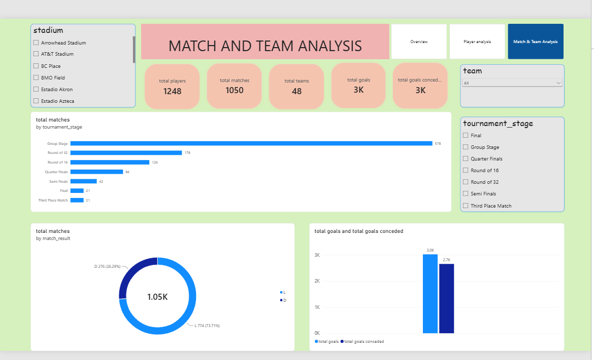

# ⚽ FIFA World Cup SQL Analytics

An end-to-end SQL Data Analytics project that demonstrates data import, database normalization, exploratory analysis, business problem solving, advanced SQL techniques, reusable SQL views, and reporting using a FIFA World Cup dataset.


## 📖 Project Overview

This project analyzes FIFA World Cup player and match data using **MySQL, SQL, and Power BI**.

The project follows an end-to-end data analytics workflow, starting with data preparation and relational database design, followed by exploratory analysis, business-oriented SQL analysis, advanced SQL techniques, reusable SQL views, and an interactive Power BI dashboard.

The main objective is to transform raw football data into meaningful analytical insights about **players, matches, teams, performance, goals, assists, ratings, and tournament stages**.

The objective of this project is to demonstrate practical SQL skills that are commonly required for entry-level Data Analyst roles.

## 🔄 Project Workflow

```text
Raw Dataset
     ↓
Data Import
     ↓
Data Cleaning & Normalization
     ↓
MySQL Database
     ↓
Exploratory SQL Analysis
     ↓
Business Questions
     ↓
Advanced SQL Analysis
     ↓
SQL Views & Insights
     ↓
Power BI Data Model
     ↓
DAX Measures
     ↓
Interactive Dashboard
     ↓
Business Insights
```

## 🎯 Project Objectives

- Build a structured and normalized relational database using MySQL.
- Analyze player and match performance using SQL.
- Perform exploratory data analysis.
- Answer business-oriented analytical questions.
- Apply advanced SQL concepts such as CTEs, subqueries, and window functions.
- Create reusable SQL views for reporting.
- Identify meaningful insights from the data.
- Build an interactive Power BI dashboard.
- Present the complete project as a professional data analytics portfolio project.

## 🗂️ Dataset

The project uses a FIFA World Cup dataset containing player, match, team, and tournament performance information.

### Dataset Includes

- Player information
- Player performance statistics
- Match information
- Team and opponent information
- Tournament stages
- Goals and assists
- Player ratings
- Passing and shooting statistics
- Defensive statistics
- Physical performance metrics
- Tournament-level player summaries

### Dataset File

`Dataset/fifa_world_cup_2026_player_performance.csv`

Additional information about the dataset is available in:

`Dataset/dataset_info.md`

## 🛢️ Database Design

The raw FIFA World Cup data was organized into a normalized relational database using MySQL.

### Main Tables

| Table                  | Description                                                 |
| ---------------------- | ----------------------------------------------------------- |
| `players`            | Stores player profile and basic information                 |
| `matches`            | Stores match details, results, opponents, and goals         |
| `player_match_stats` | Stores player performance statistics for individual matches |
| `tournament_summary` | Stores tournament-level player performance summaries        |

### Relationships

- `players` → `player_match_stats` : One-to-Many
- `matches` → `player_match_stats` : One-to-Many
- `players` → `tournament_summary` : One-to-One

The database uses primary keys, foreign keys, and a unique player-match constraint to maintain data integrity.

### ER Diagram



## 🔍 SQL Analysis

The SQL analysis is divided into multiple stages, covering exploratory analysis, business questions, advanced SQL techniques, project insights, and reusable SQL views.

### SQL Scripts

| Script                          | Purpose                                        |
| ------------------------------- | ---------------------------------------------- |
| `01_database_setup.sql`       | Creates the database and relational tables     |
| `02_data_import.sql`          | Imports the dataset into MySQL                 |
| `03_data_normalization.sql`   | Organizes and normalizes the imported data     |
| `04_exploratory_analysis.sql` | Performs exploratory data analysis             |
| `05_business_questions.sql`   | Answers business-oriented analytical questions |
| `06_advanced_sql.sql`         | Demonstrates advanced SQL techniques           |
| `07_project_insights.sql`     | Generates analytical insights from the data    |
| `08_views.sql`                | Creates reusable SQL views for reporting       |

## 📊 Power BI Dashboard

The project includes a **3-page interactive Power BI dashboard** designed to analyze player performance, match performance, and overall tournament statistics.

### Dashboard Pages

**1. Overview**

- Key performance indicators
- Player and position filters
- Goals and assists analysis
- Player ratings
- Performance by position

**2. Player Analysis**

- Top goal scorers
- Top player ratings
- Goals vs assists
- Average rating by position
- Player and position filters

**3. Match & Team Analysis**

- Total matches
- Total teams
- Total goals
- Total goals conceded
- Goals scored vs goals conceded
- Matches by tournament stage
- Match results
- Tournament stage, team, and stadium filters

## 🖼️ Dashboard Preview

### Overview



### Player Analysis



### Match & Team Analysis



## 📈 Key Metrics

| Metric                | Value |
| --------------------- | ----: |
| Total Players         | 1,248 |
| Total Matches         | 1,050 |
| Total Teams           |    48 |
| Average Player Rating |  7.61 |
| Total Goals           |   ~3K |
| Total Goals Conceded  |   ~3K |

> Note: Some large values are displayed using Power BI's abbreviated number format.

## 🛠️ Tools & Technologies

| Technology             | Purpose                                                  |
| ---------------------- | -------------------------------------------------------- |
| **MySQL**        | Database creation, management, and data storage          |
| **SQL**          | Data analysis, business questions, and advanced querying |
| **Power BI**     | Interactive dashboards and data visualization            |
| **DAX**          | Analytical measures in Power BI                          |
| **Git & GitHub** | Version control and project portfolio management         |

## 👤 Author

**Santi Soma Sekhar**

Data Analytics Portfolio Project

**Tools:** MySQL | SQL | Power BI | DAX | Git & GitHub

Aspiring Data Analyst passionate about SQL, Power BI, Excel, and Python.

GitHub:
https://github.com/SantiSomaSekhar

## ⭐ If you found this project useful, consider giving it a star.
